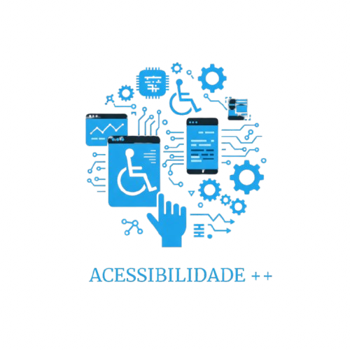

# Sobre

## Descrição

O projeto Acessibilidade++ foi criado como projeto final da matéria de Interação Humano Computador, ministrada pela docente Rejane Maria da Costa Figueiredo, na Universidade de Brasília (UnB). O projeto tem por objetivo fornecer um guia de acessibilidade de bolso, que de forma prática e rápida possa ser consultado por quem deseje criar ou adaptar um site de forma a torná-lo acessível a todos. O guia foi desenvolvido com base nas diretrizes de acessibilidade da W3C, no modelo de acessibilidade de governo eletrônico (eMAG) e no Apple Accessibility Programming Guide.

## Contribuidores

<table>
  <tr>
    <td align="center"><a href="https://github.com/henriquecq"> <b>Henrique Quenino</b></a> 
    <td align="center"><a href="https://github.com/joaombc"> <b>João Paulo</b></a>    
    <td align="center"><a href="https://github.com/Pedrin0030"> <b>Pedro Paulo</b></a>    
    <td align="center"><a href="https://github.com/aqela-batata-alt "> <b>Vitor Moreira</b></a> 
    <td align="center"><a href="https://github.com/DanielCoimbra "> <b>Daniel Coimbra</b></a> 
  </tr>
</table>

